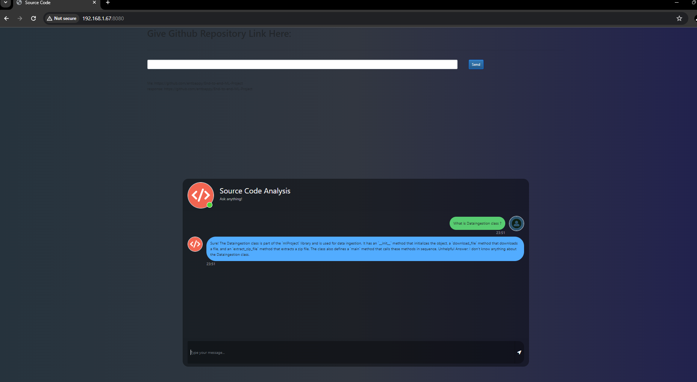

# SourceCode Analysis using Llama2

This project implements a chatbot using Retrieval Question Answering (QA) techniques. The chatbot is built using Flask, LangChain, Hugging Face Transformers, and Llama2.

## Overview
The SourceCode Analysis using Llama2 project is a system designed to analyze source code repositories using advanced natural language processing techniques. The project workflow involves several key steps:

1. ### Git Repository Ingestion:
    * The system reads a Git repository and stores its contents locally in a designated "repo" folder. This folder serves as the source of code for analysis.
2. ### Chunking:
    * After ingesting the repository, the system breaks down the source code into smaller, manageable "chunks." These chunks could represent individual files, functions, or sections of code.
3. ### Retrieval QA using Llama2:
    * With the code chunks prepared, the system applies retrieval-based question-answering (QA) techniques using Llama2. Llama2, a powerful language model, is utilized to understand and process natural language queries related to the source code.
4. ### Source Code Analysis:
    * The retrieval QA process enables the system to analyze the source code in response to user queries or prompts. Users can inquire about specific code functions, documentation, or implementation details, and the system leverages Llama2 to provide accurate and relevant responses.

## Key Components:
1. ### GitPython Integration:
    * GitPython is used to interact with Git repositories programmatically, facilitating the ingestion of source code into the system.
2. ### Chunking Mechanism:
    * The system implements a chunking mechanism to break down the source code into smaller units, enabling more focused analysis and retrieval.
3. ### GenAI (Llama2) Integration:
    * GenAI (Llama2) serves as the core AI model for natural language understanding and question-answering. It powers the retrieval-based QA process, allowing the system to respond to user queries effectively.
4. ### Flask Web Interface:
    * The project may incorporate a Flask-based web interface where users can interact with the system by submitting queries or prompts related to the source code. The interface provides a user-friendly way to access the analysis capabilities of the system.

## Installation
1. Clone the repository:
```
git clone https://github.com/deepakthakur-92/SourceCode_Analysis_using_GenAI.git
```

2. Create a virtual environment:

```
conda create -n envname python=3.8 -y
conda activate envname
pip install -r requirements.txt
```

3. Download the quantize model and place it in the model/ directory.
```
## Download the Llama 2 Model:

llama-2-7b-chat.ggmlv3.q4_0.bin


## From the following link:
https://huggingface.co/TheBloke/Llama-2-7B-Chat-GGML/tree/main
```


## Tools Used
* Flask: Web framework used for building the chatbot interface.
* LangChain: Python library for natural language processing tasks such as document retrieval and question answering.
* Hugging Face Transformers: Library providing pre-trained models and tools for natural language understanding tasks.
* Chromadb: Library for efficient similarity search and clustering of dense vectors.
* GitPython: Library for interacting with Git repositories programmatically, providing functionality for tasks such as repository management, committing changes, and querying repository history.

## Usage
1. Run the Flask app:

```
python app.py
```
2. Access the chatbot interface through your web browser at http://localhost:8080.

3. Enter your questions in the input field and click "Submit" to receive answers from the chatbot.

## Screenshot:



## Benefits:
* Efficient Source Code Understanding: By leveraging advanced NLP techniques and AI models like Llama2, the system can understand and interpret source code in a human-like manner, enabling comprehensive analysis and insights.
* Enhanced Developer Productivity: Developers and software engineers can benefit from quick access to relevant code information and insights, facilitating faster debugging, code comprehension, and development workflows.
* Improved Documentation and Knowledge Management: The system can assist in generating documentation, answering questions, and capturing knowledge about the codebase, contributing to better code maintenance and collaboration.